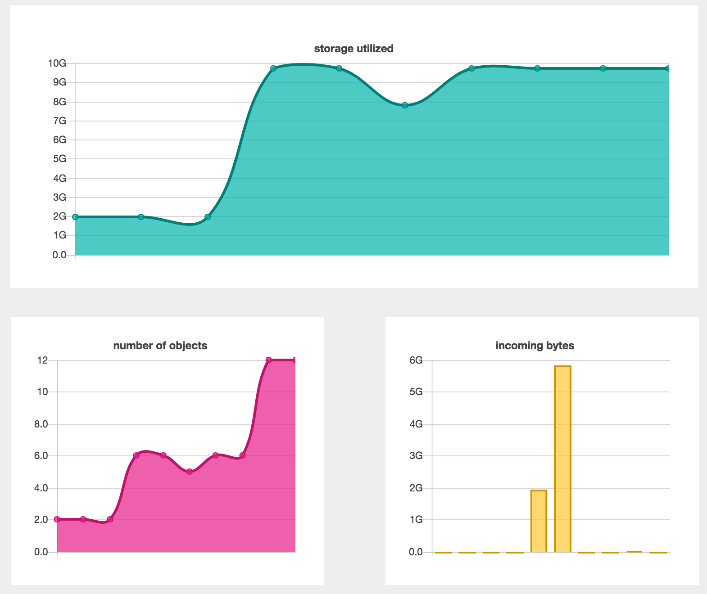

# utapi-ui
#### A web user-interface made for Zenko's Hackathon

## About UTAPI

[UTAPI](https://github.com/scality/utapi) is a Service Utilization API for [Zenko Cloud Server](https://github.com/scality/S3). It provides metrics for resource usage.

This project provides a user-interface for UTAPI.

## The UI



## Installation and Setup

#### Dependencies:

* node v6.9.5
* npm 3.10.10
* Redis server v=3.2.5
* redis-cli 3.2.5 (optional)
* aws-cli

Then, clone S3 and go to the root:

```
git clone https://github.com/scality/S3 && \
cd S3 && \
git checkout 42-hackathon-utapi && \
npm i
```

Add the following to the `config.json`:

```
"localCache": {
    "host": "127.0.0.1",
    "port": 6379
},
"utapi": {
    "workers": 1,
    "redis": {
        "host": "127.0.0.1",
        "port": 6379
    }
}
```

Start Zenko S3 server in a new shell:

```
S3BACKEND=file npm start
```

S3 server is now running, by default, on `http://localhost:8000`.

In a new shell, at the root of zenko S3, start the utapi server:

Now run utapi server:

```
npm run start_utapi
```

Utapi server is now running, by default, on `http://localhost:8100`.

Utapi also needs a Redis database, so let's start it in a new shell:

```
redis-server
```

Now clone the utapi project:

```
git clone https://github.com/scality/utapi && \
cd utapi && \
git checkout 42-hackathon-utapi && \
npm i && \
npm i aws4
```

Make sure access key and secret key is set:

```
aws configure --profile utapiuser
```

Finished config should look like:

```
AWS Access Key ID [None]: accessKey1
AWS Secret Access Key [None]: verySecretKey1
Default region name [None]:
Default output format [None]:
```

Let's test to make sure we have S3 running properly:

```
aws s3api create-bucket --bucket utapi-bucket --endpoint http://localhost:8000 --profile utapiuser
```

Now put an object to that bucket:

```
echo '01234' >! tmp && \
aws s3api put-object --bucket utapi-bucket --key utapi-object --body ./tmp --endpoint http://localhost:8000 --profile utapiuser
```

## Getting Started with the UI

Once your system is configured, in a terminal run the following commands:

```
# Clone the repo
git clone https://github.com/JibranKalia/zenkoders
cd zenkoders

# Build dependencies
npm i

# Launch app
node server
```

Finally, open you favorite web browser and type ```localhost:8080```
on the url bar.

## Technologies Used

* HTML/CSS/JS/JQuery - Front End
* Chart.js - Front End
* Express.js - Back End
* AWS S3
* Redis

## TEAM
Member | Job
------------ | -------------
[Anhelina Shulha](https://github.com/angieshu) | Front-end developer
[Giacomo Guiulfo](https://github.com/giacomoguiulfo) | Front-end developer
[Jibran Kalia](https://github.com/JibranKalia) | Back-end developer
[Tomas Bisi](https://github.com/tomasbisi) | Back-end developer, designer

## Acknowledgment
#### Special thanks to [Bennett Buchanan](https://github.com/bennettbuchanan)

[Anhelina Shulha]: (https://github.com/angieshu)
[Giacomo Guiulfo]: (https://github.com/giacomoguiulfo)
[Jibran Kalia]: (https://github.com/JibranKalia)
[Tomas Bisi]: (https://github.com/tomasbisi)
